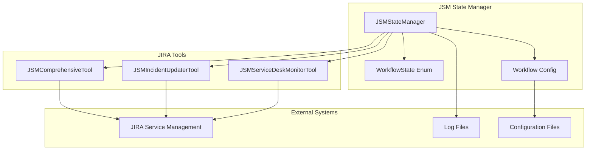
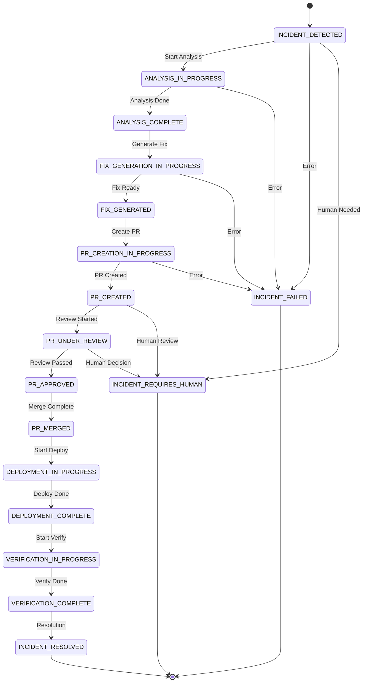
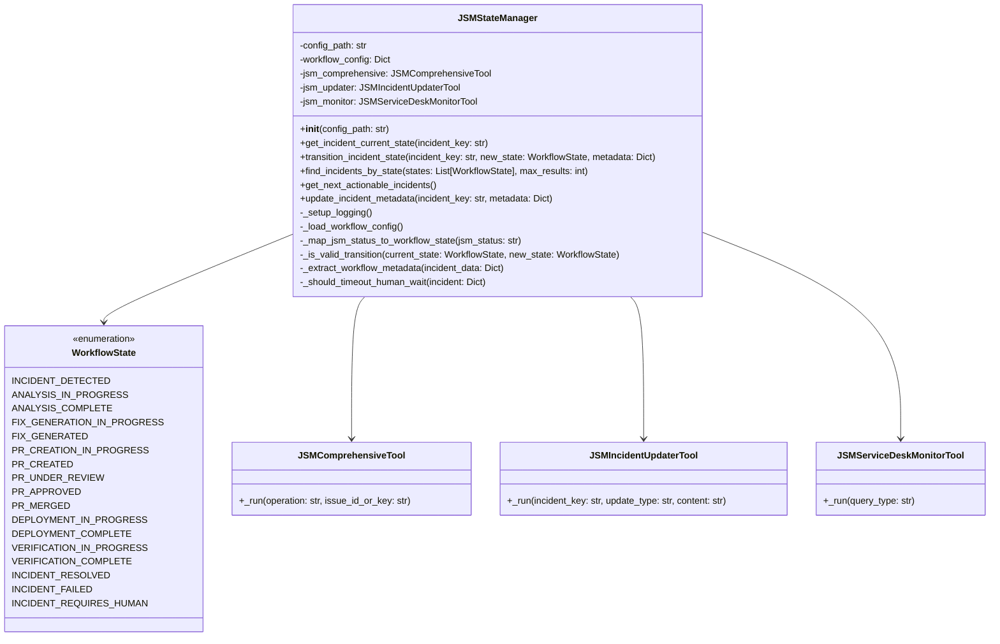
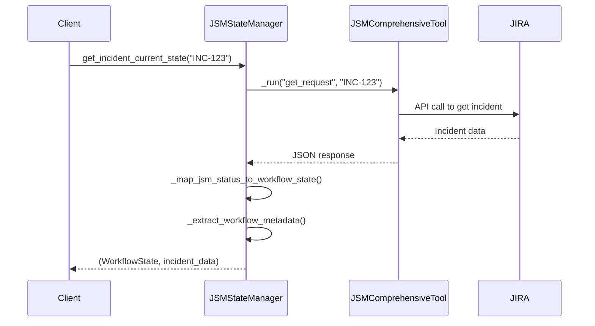
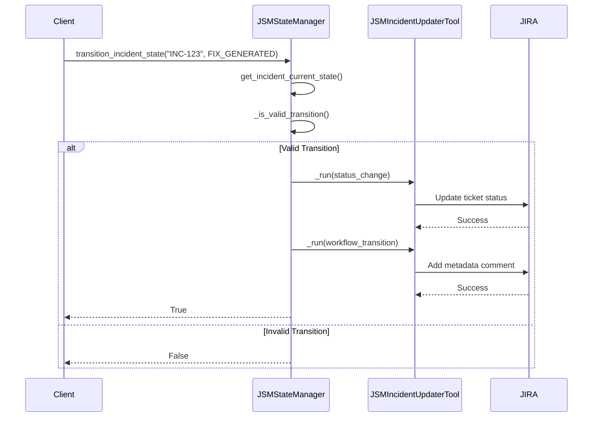
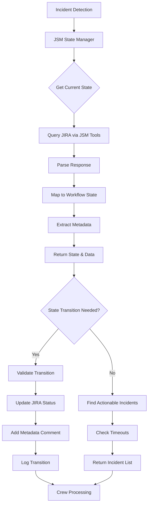
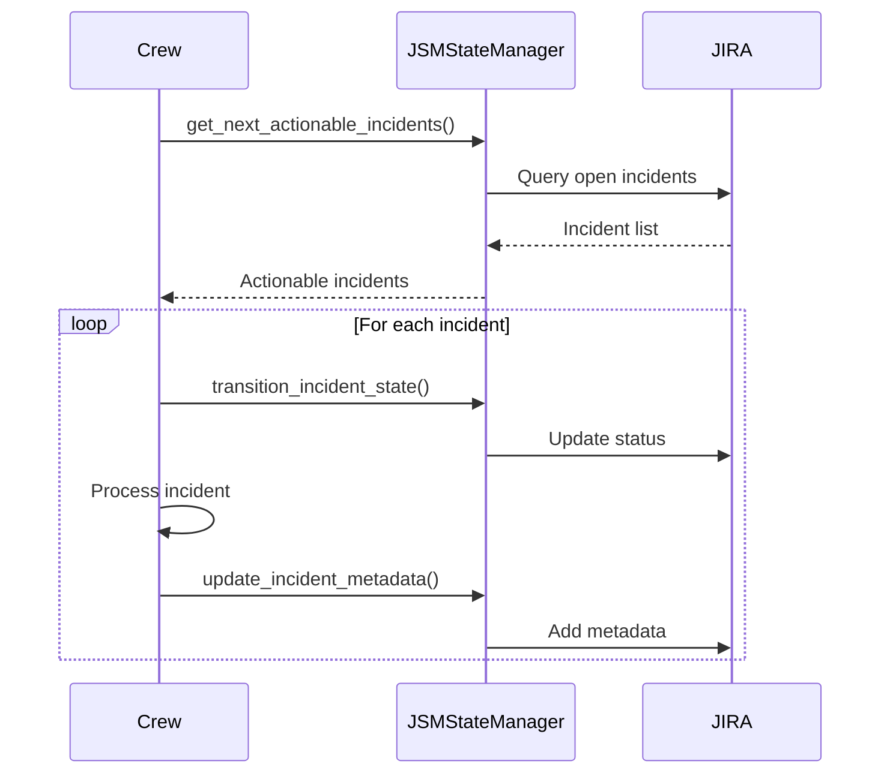

# JSM State Manager Documentation

## Overview

The `jsm_state_manager.py` module implements the JSM (Jira Service Management) State Manager for an Autonomous SRE (Site Reliability Engineering) workflow. This component serves as the central orchestrator for managing incident lifecycle states using JIRA tickets as the source of truth.

### Key Responsibilities

- **State Management**: Track and manage incident workflow states through JIRA tickets
- **Asynchronous Operations**: Enable resumable workflows across multiple crew executions
- **Integration**: Interface with JIRA via specialized tools for incident operations
- **Metadata Handling**: Store and retrieve workflow metadata in JIRA comments
- **Automation**: Identify actionable incidents for automated processing

---

## Architecture Overview



---

## Workflow State Transitions

The system defines a comprehensive set of workflow states that map to JIRA ticket statuses:



### State Definitions

| State | JIRA Status | Description |
|-------|-------------|-------------|
| `INCIDENT_DETECTED` | "To Do" | Initial state when incident is first detected |
| `ANALYSIS_IN_PROGRESS` | "In Progress" | Analysis crew is investigating the incident |
| `ANALYSIS_COMPLETE` | "Analysis Complete" | Root cause analysis completed |
| `FIX_GENERATION_IN_PROGRESS` | "Generating Fix" | Fix crew is creating a solution |
| `FIX_GENERATED` | "Fix Generated" | Solution code has been generated |
| `PR_CREATION_IN_PROGRESS` | "Creating PR" | Creating pull request for the fix |
| `PR_CREATED` | "PR Created" | Pull request has been created |
| `PR_UNDER_REVIEW` | "Under Review" | Pull request is being reviewed |
| `PR_APPROVED` | "PR Approved" | Pull request has been approved |
| `PR_MERGED` | "PR Merged" | Changes have been merged |
| `DEPLOYMENT_IN_PROGRESS` | "Deploying" | Deployment is in progress |
| `DEPLOYMENT_COMPLETE` | "Deployed" | Deployment has completed |
| `VERIFICATION_IN_PROGRESS` | "Verifying Fix" | Verifying the fix works |
| `VERIFICATION_COMPLETE` | "Verification Complete" | Fix has been verified |
| `INCIDENT_RESOLVED` | "Done" | Incident has been fully resolved |
| `INCIDENT_FAILED` | "Failed" | Incident resolution failed |
| `INCIDENT_REQUIRES_HUMAN` | "Needs Human Intervention" | Human intervention required |

---

## Class Structure



---

## Core Methods

### 1. State Retrieval

#### `get_incident_current_state(incident_key: str)`

Retrieves the current workflow state of an incident from JIRA.

**Flow:**


### 2. State Transitions

#### `transition_incident_state(incident_key: str, new_state: WorkflowState, metadata: Dict)`

Transitions an incident to a new workflow state with validation.

**Flow:**


### 3. Incident Discovery

#### `find_incidents_by_state(states: List[WorkflowState], max_results: int)`

Finds incidents in specific workflow states.

**Process:**
1. Convert workflow states to JIRA statuses
2. Query JIRA using JSM Service Desk Monitor
3. Parse and normalize response data
4. Enrich incidents with workflow state information
5. Return standardized incident data

### 4. Actionable Incident Identification

#### `get_next_actionable_incidents()`

Identifies incidents ready for automated processing.

**Logic:**
- **Actionable States**: `INCIDENT_DETECTED`, `ANALYSIS_COMPLETE`, `FIX_GENERATED`, `PR_MERGED`, `DEPLOYMENT_COMPLETE`
- **Timeout Logic**: Checks human-wait states for timeout conditions
- **Returns**: List of incidents ready for crew processing

---

## Data Flow



---

## Configuration Management

The system uses YAML configuration files for:

- **State Transitions**: Valid transitions between workflow states
- **Timeout Settings**: Maximum wait times for human intervention states
- **JIRA Mappings**: Custom status mappings for different JIRA configurations

### Example Configuration Structure:

```yaml
state_transitions:
  INCIDENT_DETECTED:
    next_states:
      - ANALYSIS_IN_PROGRESS
      - INCIDENT_FAILED
      - INCIDENT_REQUIRES_HUMAN
    max_wait_hours: 1
  
  ANALYSIS_IN_PROGRESS:
    next_states:
      - ANALYSIS_COMPLETE
      - INCIDENT_FAILED
    max_wait_hours: 4
  
  PR_CREATED:
    next_states:
      - PR_UNDER_REVIEW
      - INCIDENT_REQUIRES_HUMAN
    max_wait_hours: 24
```

---

## Error Handling and Logging

### Logging Strategy

- **File-based Logging**: `logs/jsm_state_manager.log`
- **Structured Logging**: Timestamp, level, and message format
- **Operation Tracking**: State transitions, errors, and metadata updates

### Error Scenarios

1. **JIRA Connection Failures**: Logged and re-raised
2. **Invalid State Transitions**: Logged as warnings, operation fails gracefully
3. **JSON Parsing Errors**: Handled with fallback parsing strategies
4. **Configuration Missing**: Fatal error with clear messaging

---

## Integration Points

### With Crew Executions



### With External Systems

- **GitHub Integration**: PR state tracking and updates
- **Kubernetes**: Deployment status monitoring
- **Monitoring Systems**: Incident detection and verification

---

## Best Practices

### State Management
1. **Always validate transitions** before updating JIRA
2. **Store rich metadata** for audit trails and debugging
3. **Handle partial failures** gracefully with rollback capabilities
4. **Use timeout mechanisms** to prevent stuck workflows

### Performance
1. **Batch operations** when possible to reduce JIRA API calls
2. **Cache incident data** for repeated operations
3. **Use pagination** for large incident queries
4. **Implement retry logic** for transient failures

### Monitoring
1. **Track state transition metrics** for workflow health
2. **Monitor timeout incidents** for process improvements
3. **Alert on failed transitions** for immediate attention
4. **Log all metadata updates** for compliance

---

## Usage Examples

### Basic State Checking

```python
# Initialize state manager
state_manager = JSMStateManager()

# Get current state of an incident
current_state, incident_data = state_manager.get_incident_current_state("INC-123")
print(f"Incident INC-123 is in state: {current_state.name}")
```

### State Transition

```python
# Transition to next state with metadata
metadata = {
    "analysis_results": "Memory leak detected in service X",
    "recommended_fix": "Increase memory limits and add cleanup logic"
}

success = state_manager.transition_incident_state(
    "INC-123",
    WorkflowState.ANALYSIS_COMPLETE,
    metadata
)
```

### Finding Actionable Incidents

```python
# Get incidents ready for processing
actionable_incidents = state_manager.get_next_actionable_incidents()

for incident in actionable_incidents:
    print(f"Process incident: {incident['key']} - {incident['workflow_state']}")
```

---

## Future Enhancements

1. **Parallel Processing**: Support for concurrent incident processing
2. **Advanced Querying**: Custom JQL support for complex incident searches
3. **Webhook Integration**: Real-time state change notifications
4. **Metrics Dashboard**: Visual representation of workflow health
5. **State Machine Validation**: Formal verification of state transition logic

---

## Troubleshooting

### Common Issues

1. **Configuration Not Found**: Ensure `workflow_states.yaml` exists in config directory
2. **Invalid Transitions**: Check workflow configuration for allowed transitions
3. **JIRA Authentication**: Verify JSM tool credentials and permissions
4. **JSON Parsing Failures**: Enable debug logging to see raw JIRA responses

### Debug Mode

Enable detailed logging by setting the log level to DEBUG:

```python
import logging
logging.getLogger('jsm_state_manager').setLevel(logging.DEBUG)
```

This documentation provides a comprehensive overview of the JSM State Manager's architecture, functionality, and usage patterns for maintaining robust incident workflow management in the Autonomous SRE system.
