# Autonomous SRE Bot

An intelligent Site Reliability Engineering (SRE) automation platform powered by CrewAI that provides autonomous incident management and self-healing capabilities for modern cloud-native applications.

## 🌟 Overview

The Autonomous SRE Bot consists of two main crews working in tandem:

- **🔍 Incident Crew**: Proactive monitoring, log analysis, and incident creation
- **🔧 Self-Heal Crew**: Autonomous incident resolution and self-healing workflows

This system integrates with Atlassian (Jira Service Management), Kubernetes, GitHub, and various observability tools to provide end-to-end incident lifecycle management.

## 🏗️ Architecture

```mermaid
flowchart TB
    subgraph IC["🔍 Incident Crew"]
        LC["📊 Log Collector<br/>🔍 Monitor & Collect"]
        LA["🧠 Log Analyzer<br/>⚡ Pattern Recognition"] 
        IM["🚨 Incident Manager<br/>📋 Create Tickets"]
        LC --> LA --> IM
    end
    
    subgraph SHC["🔧 Self-Heal Crew"]
        IRM["👨‍💼 Incident Resolution Manager<br/>🎯 Orchestrate Workflow"]
        JM["🎫 JIRA Manager<br/>📝 Ticket Operations"]
        RCA["🔬 Root Cause Analyzer<br/>🕵️ Investigate Issues"]
        CFG["⚙️ Code Fix Generator<br/>🛠️ Auto-Fix Code"]
        DM["📈 Deployment Monitor<br/>✅ Verify Health"]
        IRM --> JM
        IRM --> RCA
        RCA --> CFG
        CFG --> DM
    end
    
    subgraph EXT["🌐 External Systems"]
        LOGS["📊 Logs & Monitoring<br/>📡 Middleware.io"]
        JSM["📋 Jira Service Management<br/>🎫 Issue Tracking"]
        K8S["☸️ Kubernetes<br/>🚀 Container Orchestration"]
        GH["� GitHub<br/>💻 Code Repository"]
        MCP["🔗 Atlassian MCP Server<br/>🌉 API Bridge"]
    end
    
    IC -->|🚨 Creates Incidents| SHC
    LC -.->|👀 Monitors| LOGS
    IM -->|📝 Creates Issues| JSM
    JM <-->|🔄 Manages Tickets| MCP
    RCA -->|🔍 Analyzes| K8S
    CFG -->|📤 Creates PRs| GH
    DM -->|📊 Monitors| K8S
    
    style IC fill:#e1f5fe,stroke:#01579b,stroke-width:3px,color:#000
    style SHC fill:#f3e5f5,stroke:#4a148c,stroke-width:3px,color:#000
    style EXT fill:#fff3e0,stroke:#e65100,stroke-width:3px,color:#000
    
    style LC fill:#81c784,stroke:#388e3c,stroke-width:2px,color:#000
    style LA fill:#64b5f6,stroke:#1976d2,stroke-width:2px,color:#000
    style IM fill:#ffb74d,stroke:#f57c00,stroke-width:2px,color:#000
    
    style IRM fill:#ba68c8,stroke:#7b1fa2,stroke-width:2px,color:#000
    style JM fill:#4db6ac,stroke:#00695c,stroke-width:2px,color:#000
    style RCA fill:#f06292,stroke:#c2185b,stroke-width:2px,color:#000
    style CFG fill:#aed581,stroke:#689f38,stroke-width:2px,color:#000
    style DM fill:#ffab91,stroke:#d84315,stroke-width:2px,color:#000
    
    style LOGS fill:#90caf9,stroke:#1565c0,stroke-width:2px,color:#000
    style JSM fill:#a5d6a7,stroke:#2e7d32,stroke-width:2px,color:#000
    style K8S fill:#ffcc80,stroke:#ef6c00,stroke-width:2px,color:#000
    style GH fill:#ce93d8,stroke:#8e24aa,stroke-width:2px,color:#000
    style MCP fill:#80deea,stroke:#00838f,stroke-width:2px,color:#000
```



## 🔍 Incident Crew

The Incident Crew is responsible for **proactive incident detection and creation**. It consists of specialized agents that work together to monitor systems and create well-documented incidents.

### Agents

#### 1. Log Collector Agent
- **Role**: SRE Log Collection Specialist
- **Responsibility**: Retrieve and organize relevant logs for incident analysis
- **Tools**: 
  - `MiddlewareLogsTool`: Integrates with middleware.io for log collection
- **Capabilities**:
  - Query logs with appropriate filters
  - Extract relevant error patterns
  - Organize logs by time, service, and severity

#### 2. Log Analyzer Agent
- **Role**: SRE Log Analysis Expert  
- **Responsibility**: Analyze logs to identify root causes and patterns
- **Capabilities**:
  - Pattern recognition in error logs
  - Root cause identification
  - Severity assessment
  - Trend analysis across time periods

#### 3. Incident Manager Agent
- **Role**: SRE Incident Manager
- **Responsibility**: Create and manage incidents in Jira Service Management
- **Tools**:
  - `JSMIncidentCreatorTool`: Creates incidents in JSM
- **Capabilities**:
  - Prioritize issues based on analysis
  - Create well-documented incidents
  - Assign appropriate resources
  - Include all relevant technical details

### Workflow

```mermaid
sequenceDiagram
    participant LC as 📊 Log Collector<br/>🔍 Monitor
    participant LA as 🧠 Log Analyzer<br/>⚡ Process
    participant IM as 🚨 Incident Manager<br/>📝 Create
    participant MW as 📡 Middleware.io<br/>📈 Logs API
    participant JSM as 🎫 JIRA Service Management<br/>📋 Ticketing
    participant SHC as 🔧 Self-Heal Crew<br/>🤖 Auto-Fix

    rect rgb(255, 248, 225)
        Note over LC, MW: 🔄 Continuous Monitoring Phase
        loop 🔄 Every 5 minutes
            LC->>+MW: 🔍 Query logs with filters
            MW-->>-LC: 📊 Return log data
            LC->>+LA: 📤 Organize & pass logs
            
            LA->>LA: 🧠 Pattern recognition
            LA->>LA: 🔍 Root cause identification
            LA->>-LA: ⚠️ Severity assessment
        end
    end
    
    rect rgb(255, 235, 238)
        Note over LA, SHC: 🚨 Critical Issue Detection
        alt 🔥 Critical Issue Detected
            LA->>+IM: 📊 Pass analysis results
            IM->>+JSM: 🚨 Create incident ticket
            JSM-->>-IM: ✅ Return ticket ID
            IM->>+SHC: 🚀 Trigger self-healing
            SHC-->>-IM: 🤖 Acknowledge automation
            Note over IM, SHC: 🎯 Handoff to autonomous resolution
        else ✅ No Critical Issues
            LA->>LC: 👍 Continue monitoring
            Note over LA, LC: 🔄 Return to monitoring cycle
        end
    end
```



1. **🔍 Log Collection**: Continuously monitor and collect logs from various sources
2. **🧠 Analysis**: Analyze collected logs for patterns and anomalies
3. **🚨 Incident Creation**: Create structured incidents in JSM with detailed analysis
4. **🤖 Handoff**: Pass incidents to Self-Heal Crew for automated resolution

### Usage

```bash
# Run incident management crew
uv run incident_management

# Train the crew with custom data
uv run train

# Test incident management
uv run test
```

## 🔧 Self-Heal Crew

The Self-Heal Crew provides **autonomous incident resolution** through a sophisticated multi-agent system that can diagnose, fix, and deploy solutions automatically.

### Agents

#### 1. Incident Resolution Manager
- **Role**: Autonomous SRE Incident Resolution Manager
- **Responsibility**: Orchestrate the complete incident resolution workflow
- **Capabilities**:
  - Monitor for new incidents using configurable filters
  - Assess automation feasibility
  - Delegate tasks to specialized agents
  - Track progress through workflow states
  - Ensure end-to-end resolution

#### 2. JIRA Manager Agent
- **Role**: JIRA Service Management Operations Specialist
- **Responsibility**: Handle all JIRA-related operations
- **Tools**: 
  - `JSMIncidentUpdaterTool`
  - `JSMServiceDeskMonitorTool`
  - `JSMKnowledgeSearchTool`
  - `JSMSLAMonitorTool`
- **Capabilities**:
  - Ticket management and state transitions
  - Structured comment management
  - Workflow compliance
  - Progress tracking and audit trails

#### 3. Root Cause Analyzer Agent
- **Role**: Site Reliability Engineer Root Cause Analysis Specialist
- **Responsibility**: Comprehensive root cause analysis
- **Tools**:
  - Kubernetes monitoring tools
  - GitHub MCP tools for code analysis
  - Log correlation tools
- **Capabilities**:
  - Correlate JIRA tickets with system state
  - Analyze Kubernetes cluster health
  - Examine source code for issues
  - Create detailed remediation plans

#### 4. Code Fix Generator Agent
- **Role**: Automated Code Fix and Pull Request Specialist
- **Responsibility**: Implement fixes and create pull requests
- **Tools**:
  - GitHub MCP tools for code operations
  - Pull request automation
- **Capabilities**:
  - Generate precise code fixes
  - Create branches with JSM ticket IDs
  - Submit pull requests with documentation
  - Follow development best practices

#### 5. Deployment Monitor Agent
- **Role**: Deployment and Recovery Verification Specialist
- **Responsibility**: Monitor deployments and verify fixes
- **Capabilities**:
  - Track deployment lifecycle
  - Perform health checks
  - Validate system stability
  - Confirm incident resolution

### Workflow States


The self-healing workflow follows these states:

1. **🚨 Incident Detection** → **🤖 In Progress**
2. **🤖 In Progress** → **🎯 RCA Completed**
3. **🎯 RCA Completed** → **🔧 Code Fix Completed** 
4. **🔧 Code Fix Completed** → **🚀 Deployment Done**
5. **🚀 Deployment Done** → **💚 Deployment Validated**
6. **💚 Deployment Validated** → **🎉 Done**

Alternative paths:
- **👨‍💻 Needs Human Intervention** (for complex issues)
- **🚨 Escalated** (for urgent manual review)

### Configuration

The self-heal crew uses configurable filters:

```yaml
# Workflow input parameters
project_filter: "DEVOPS,PLATFORM"
assignee_filter: "autonomous-sre-bot"
priority_filter: "High,Critical"
max_incidents: 5
```

### Usage

```bash
# Run self-healing crew
uv run self_heal

# Test self-healing functionality  
uv run test_self_heal
```

## 🔗 Atlassian MCP Server Integration

The project includes a dedicated [Atlassian MCP Server](./atlassian-mcp-server/) that provides HTTP-based access to Jira and Confluence operations.

### Features

- **Docker Compose Setup**: Easy deployment with `docker-compose up -d`
- **HTTP API Mode**: Streamable HTTP mode instead of stdio
- **Comprehensive Tools**: Full Jira and Confluence operation support
- **Configurable Filtering**: Space and project-based filtering
- **Security Options**: Read-only mode and tool filtering

### Quick Start

```bash
cd atlassian-mcp-server
docker-compose up -d

# Health check
curl -f http://localhost:8080/health

# View logs
docker-compose logs -f mcp-atlassian
```

### Available Tools

**Jira Operations:**
- `jira_get_issue` - Get issue details
- `jira_search` - Search with JQL
- `jira_create_issue` - Create new issues
- `jira_update_issue` - Update existing issues
- `jira_transition_issue` - Change issue status
- `jira_add_comment` - Add comments

**Confluence Operations:**
- `confluence_search` - Search content with CQL
- `confluence_get_page` - Retrieve page content
- `confluence_create_page` - Create new pages
- `confluence_update_page` - Update existing pages

For detailed setup instructions, see [MCP Docker Compose README](./atlassian-mcp-server/MCP_DOCKER_COMPOSE_README.md).

## 🚀 Installation

### Prerequisites

- Python 3.10-3.12
- Docker and Docker Compose
- Atlassian Cloud instance with API access
- Kubernetes cluster access (for self-healing)
- GitHub repository access

### Setup

1. **Clone the repository**
   ```bash
   git clone https://github.com/manoharnv/autonomous_sre_bot.git
   cd autonomous_sre_bot
   ```

2. **Install dependencies**
   ```bash
   pip install uv
   uv sync
   ```

3. **Configure environment**
   ```bash
   cp .env.example .env
   # Edit .env with your credentials
   ```

4. **Start Atlassian MCP Server**
   ```bash
   cd atlassian-mcp-server
   docker-compose up -d
   cd ..
   ```

5. **Run the system**
   ```bash
   # Start incident management
   uv run incident_management
   
   # Or start self-healing
   uv run self_heal
   ```

## 🔧 Configuration

### Environment Variables

```bash
# Core Configuration
OPENAI_API_KEY=your_api_key_here
DEEPSEEK_API_KEY=your_deepseek_key_here

# Atlassian Configuration
ATLASSIAN_URL=https://yourinstance.atlassian.net
ATLASSIAN_USER_ID=your.email@company.com
ATLASSIAN_TOKEN=your_atlassian_token
ATLASSIAN_CLOUD_ID=your_cloud_id

# Kubernetes Configuration
KUBECONFIG=/path/to/your/kubeconfig

# GitHub Configuration (for MCP)
GITHUB_TOKEN=your_github_token
```

### Agent Configuration

Agents are configured via YAML files in `src/autonomous_sre_bot/config/`:

- `agents.yaml` - Incident crew agent definitions
- `self_heal_agents.yaml` - Self-heal crew agent definitions  
- `tasks.yaml` - Task definitions
- `self_heal_tasks.yaml` - Self-heal task definitions
- `workflow_states.yaml` - Workflow state transitions

## 📊 Monitoring and Observability

The system provides comprehensive logging and monitoring:

- **Structured Logging**: JSON-formatted logs with correlation IDs
- **Workflow Tracking**: State transitions and progress monitoring
- **Performance Metrics**: Agent execution times and success rates
- **Audit Trail**: Complete history of actions taken

Logs are stored in the `logs/` directory:
- `autonomous_sre.log` - Main application logs
- `mcp_github.log` - GitHub MCP operations
- `mcp_jira.log` - Jira MCP operations
- `refactored_self_heal_*.json` - Self-healing workflow results

## 🤝 Contributing

1. Fork the repository
2. Create a feature branch
3. Make your changes
4. Add tests
5. Submit a pull request

## 📄 License

This project is licensed under the MIT License - see the LICENSE file for details.

## 🆘 Support

For support and questions:

- Create an issue in the GitHub repository
- Check the [MCP Server Documentation](./atlassian-mcp-server/MCP_DOCKER_COMPOSE_README.md)
- Review the configuration files in `src/autonomous_sre_bot/config/`

## 🔮 Roadmap

- [ ] Machine Learning-based incident prediction
- [ ] Multi-cloud support (AWS, Azure, GCP)
- [ ] Advanced security scanning integration
- [ ] Custom webhook integrations
- [ ] Real-time dashboard and metrics
- [ ] Slack/Teams notification integration