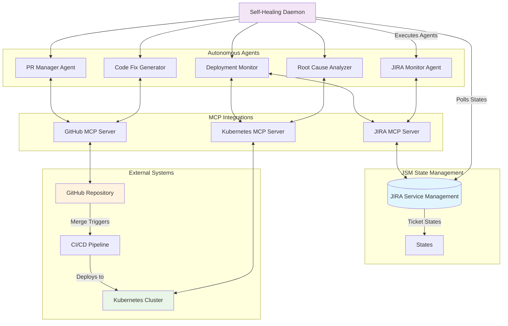
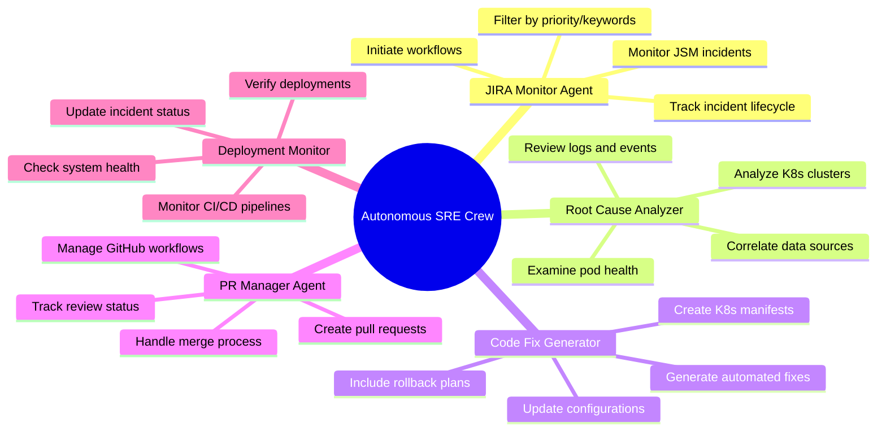
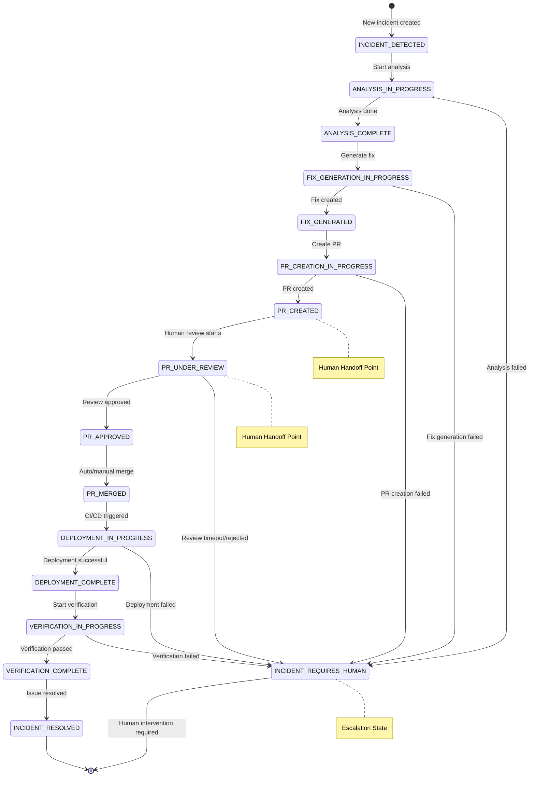
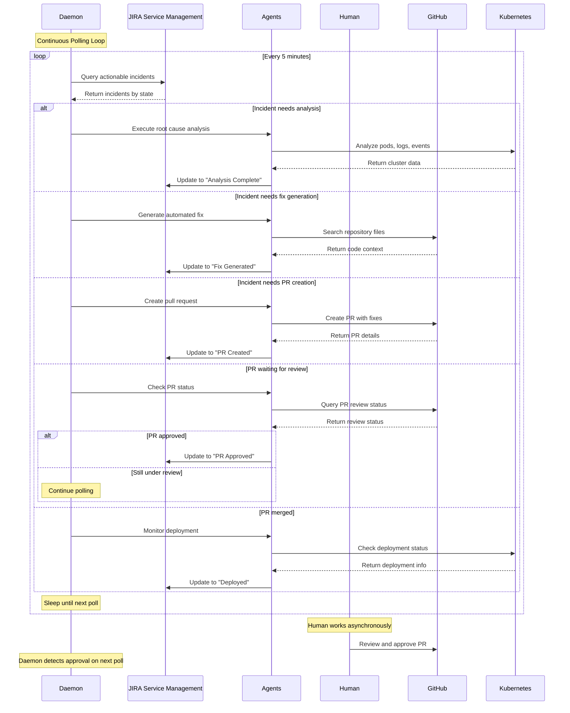
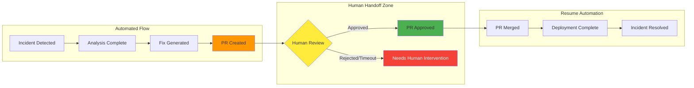
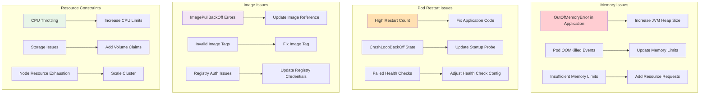
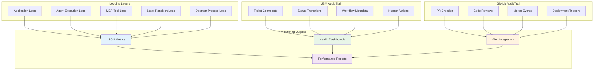

# Autonomous SRE Self-Healing Crew

This module implements a complete autonomous SRE workflow using CrewAI and Model Context Protocol (MCP) integrations with **JSM State Management**. The self-healing crew consists of five specialized agents that work together to detect, analyze, and automatically resolve infrastructure incidents using JIRA Service Management as the state manager for asynchronous workflows.

## 🔄 State-Driven Architecture

Unlike traditional sequential workflows, this implementation uses **JSM tickets as the source of truth** for workflow state, enabling:

- ✅ **Asynchronous Processing** - Agents don't wait for human reviews/merges
- ✅ **Resumable Workflows** - Pick up where previous executions left off  
- ✅ **Multi-Incident Handling** - Process multiple incidents simultaneously
- ✅ **Human-in-the-Loop** - Seamless handoffs for reviews and approvals
- ✅ **Persistent State** - Survive restarts and failures

## Architecture Overview

### High-Level Architecture



### Agent Responsibilities



## Components

### Agents

1. **JIRA Monitor Agent** - Monitors JIRA Service Management for new incidents
2. **Root Cause Analyzer Agent** - Analyzes Kubernetes clusters to identify root causes
3. **Code Fix Generator Agent** - Generates automated fixes based on analysis
4. **PR Manager Agent** - Creates and manages GitHub pull requests
5. **Deployment Monitor Agent** - Monitors deployments and verifies resolutions

### MCP Tools Integration

- **JIRA MCP**: Real integration with Atlassian JIRA Service Management
- **GitHub MCP**: Real integration with GitHub repositories and pull requests
- **Kubernetes MCP**: Real integration with Kubernetes clusters via `@manusa/kubernetes-mcp-server`

### Configuration Files

- `self_heal_agents.yaml` - Agent definitions and configurations
- `self_heal_tasks.yaml` - Task definitions and workflow configuration

## Prerequisites

### Environment Variables

```bash
# Required
export GITHUB_TOKEN="your_github_token"
export ATLASSIAN_TOKEN="your_atlassian_token"
export ATLASSIAN_CLOUD_ID="your_cloud_id"

# Optional (defaults to ~/.kube/config)
export KUBECONFIG="/path/to/your/kubeconfig"
```

### Dependencies

Install the required MCP server:
```bash
npm install -g @manusa/kubernetes-mcp-server
```

## 🚀 Usage

### Daemon Mode (Recommended)

For continuous incident monitoring and processing:

```bash
# Run daemon with default settings (5-minute polling)
python daemon_self_heal.py

# Run with custom polling interval (1 minute for faster response)
python daemon_self_heal.py --poll-interval 60

# Run for specific namespace and priority
python daemon_self_heal.py --namespace staging --priority Critical

# Run with debug logging for troubleshooting
python daemon_self_heal.py --log-level DEBUG
```

### One-Shot Execution

For processing current actionable incidents once:

```bash
# Process incidents once with default settings
python main_self_heal.py

# Process with specific criteria
python main_self_heal.py --namespace production --priority High

# Dry-run mode (analysis only, no changes)
python main_self_heal.py --dry-run
```

### Command Line Options

```bash
python main_self_heal.py [OPTIONS]

Options:
  --namespace TEXT         Kubernetes namespace to monitor (default: production)
  --priority [Low|Medium|High|Critical]  
                          Minimum incident priority (default: High)
  --keywords TEXT         Comma-separated incident keywords to filter
  --dry-run              Analyze incidents but do not create fixes or PRs
  --log-level [DEBUG|INFO|WARNING|ERROR]
                          Logging level (default: INFO)
  --config-path TEXT      Path to configuration files
  --output-file TEXT      File to save workflow results (JSON format)
  --help                  Show this message and exit
```

### Programmatic Usage

```python
from autonomous_sre_bot.self_heal_crew import create_self_healing_crew

# Create the crew
crew = create_self_healing_crew()

# Execute workflow
result = crew.execute_self_healing_workflow({
    "namespace": "production",
    "priority_threshold": "High",
    "incident_keywords": ["OutOfMemory", "CrashLoopBackOff"]
})

print(f"Workflow success: {result['success']}")
```

## 🔄 State-Driven Workflow

### Workflow State Machine



### Asynchronous Processing Flow



### JSM Ticket States

The workflow uses JSM ticket statuses to track progress:

| State | JSM Status | Description | Agent Responsible | Human Required |
|-------|------------|-------------|-------------------|----------------|
| `INCIDENT_DETECTED` | "To Do" | New incident needs analysis | JIRA Monitor | ❌ |
| `ANALYSIS_IN_PROGRESS` | "In Progress" | Root cause analysis running | Root Cause Analyzer | ❌ |
| `ANALYSIS_COMPLETE` | "Analysis Complete" | Ready for fix generation | - | ❌ |
| `FIX_GENERATION_IN_PROGRESS` | "Generating Fix" | Creating automated fixes | Code Fix Generator | ❌ |
| `FIX_GENERATED` | "Fix Generated" | Ready for PR creation | - | ❌ |
| `PR_CREATION_IN_PROGRESS` | "Creating PR" | Creating pull request | PR Manager | ❌ |
| `PR_CREATED` | "PR Created" | **Human Review Required** | PR Manager | ✅ |
| `PR_UNDER_REVIEW` | "Under Review" | **Human Review in Progress** | PR Manager | ✅ |
| `PR_APPROVED` | "PR Approved" | Ready for merge | PR Manager | ❌ |
| `PR_MERGED` | "PR Merged" | Deployment monitoring starts | - | ❌ |
| `DEPLOYMENT_IN_PROGRESS` | "Deploying" | Monitoring CI/CD pipeline | Deployment Monitor | ❌ |
| `DEPLOYMENT_COMPLETE` | "Deployed" | Ready for verification | - | ❌ |
| `VERIFICATION_IN_PROGRESS` | "Verifying Fix" | Verifying resolution | Deployment Monitor | ❌ |
| `INCIDENT_RESOLVED` | "Done" | **Fully Resolved** | - | ❌ |
| `INCIDENT_REQUIRES_HUMAN` | "Needs Human Intervention" | **Escalated** | - | ✅ |

### Human Handoff Points



The system seamlessly handles human involvement at key points:

1. **PR Review** (`PR_CREATED` → `PR_APPROVED`)
   - Agents create PR and wait for human review
   - Daemon polls PR status and resumes when approved
   - Timeout escalation if review takes too long

2. **PR Merge** (`PR_APPROVED` → `PR_MERGED`)
   - Can be automated or require human merge
   - Configurable based on repository settings

3. **Escalation** (Any state → `INCIDENT_REQUIRES_HUMAN`)
   - Automatic escalation on timeouts or failures
   - Human can review and manually transition back to automated flow

## Testing

Run the test suite to validate all components:

```bash
python test_self_heal.py
```

The test suite validates:
- Environment variable configuration
- MCP tool initialization
- Configuration file loading
- Crew initialization
- Basic workflow preparation

## Configuration

### Agent Configuration (`self_heal_agents.yaml`)

Each agent can be configured with:
- `max_iter`: Maximum iterations for task execution
- `memory`: Enable/disable agent memory
- `verbose`: Enable/disable verbose logging
- `allow_delegation`: Allow agent to delegate tasks

### Task Configuration (`self_heal_tasks.yaml`)

Tasks define:
- Description and expected output
- Context dependencies between tasks
- Agent assignments
- Workflow process configuration

## Logging

Logs are written to the `logs/` directory:
- `self_healing_crew.log` - Main crew execution logs
- `mcp_*.log` - MCP tool operation logs
- `test_self_heal.log` - Test execution logs

## Example Incident Types



The self-healing crew can automatically handle:

1. **Memory Issues**
   - OutOfMemoryError in applications
   - Pod OOMKilled events
   - Insufficient memory limits

2. **Pod Restart Issues**
   - High restart counts
   - CrashLoopBackOff states
   - Failed health checks

3. **Image Issues**
   - ImagePullBackOff errors
   - Invalid image tags
   - Registry authentication issues

4. **Resource Constraints**
   - CPU throttling
   - Storage issues
   - Node resource exhaustion

## Security Considerations

- All MCP tools use authenticated connections
- Environment variables store sensitive tokens
- GitHub PRs follow established review processes
- Kubernetes access respects RBAC permissions

## Monitoring and Observability



The crew provides:
- Comprehensive logging of all operations
- JSON output for integration with monitoring systems
- JIRA ticket updates with resolution details
- GitHub PR tracking for audit trails

## Troubleshooting

### Common Issues

1. **Environment Variables Not Set**
   ```bash
   # Check environment
   python test_self_heal.py
   ```

2. **MCP Server Connection Issues**
   ```bash
   # Verify Kubernetes MCP server
   npx @manusa/kubernetes-mcp-server --help
   ```

3. **Configuration File Errors**
   ```bash
   # Validate YAML syntax
   python -c "import yaml; yaml.safe_load(open('src/autonomous_sre_bot/config/self_heal_agents.yaml'))"
   ```

4. **Kubernetes Access Issues**
   ```bash
   # Test kubectl access
   kubectl get pods -n production
   ```

## Contributing

When adding new incident types or fixes:

1. Update agent configurations in `self_heal_agents.yaml`
2. Add new tasks in `self_heal_tasks.yaml`
3. Extend MCP tools as needed
4. Add test cases in `test_self_heal.py`
5. Update documentation

## License

This project is part of the Autonomous SRE Bot capstone project.

python -m src.autonomous_sre_bot.self_heal_crew