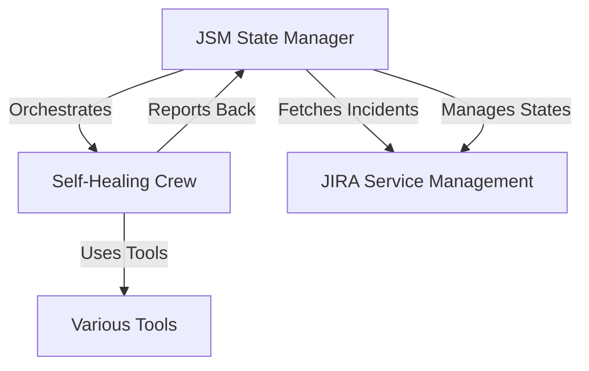
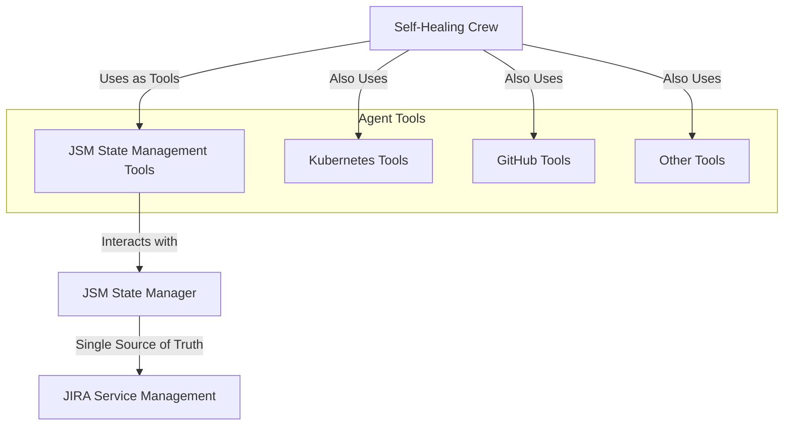
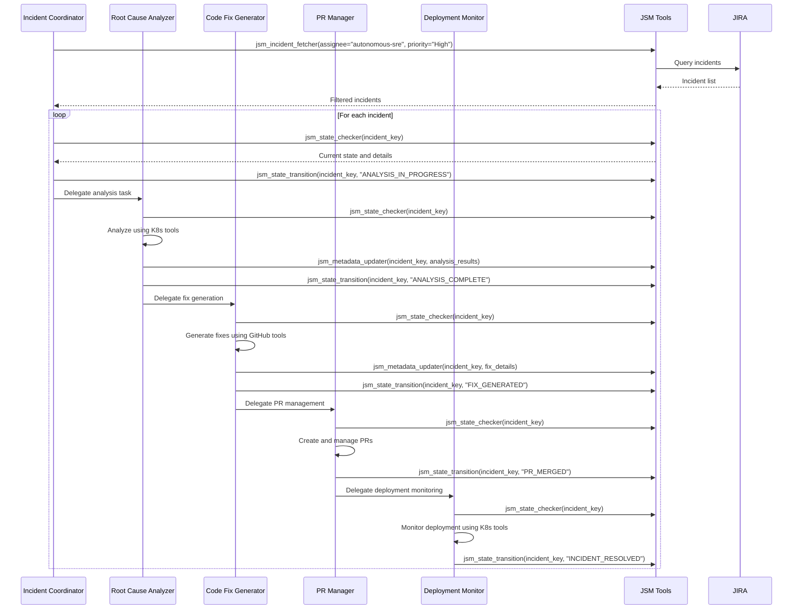

# Refactored Autonomous SRE Self-Healing Architecture

## Overview

The refactored architecture implements an agent-driven workflow where the JSM State Manager functions as tools for the agents rather than an orchestrating component. This design follows the principle of having JSM as the single source of truth while empowering agents to independently fetch and manage incidents.

## Architecture Changes

### Before (Original Architecture)


### After (Refactored Architecture)


## Key Components

### 1. JSM State Management Tools

The JSM State Manager functionality is now exposed as CrewAI tools:

#### JSMIncidentFetcherTool
- **Purpose**: Fetch incidents by assignee and priority
- **Usage**: Agents use this to find incidents that need resolution
- **Parameters**: `assignee`, `priority`, `status`, `max_results`

#### JSMStateTransitionTool
- **Purpose**: Transition incidents to new workflow states
- **Usage**: Agents use this to update incident progress
- **Parameters**: `incident_key`, `new_state`, `metadata`

#### JSMStateCheckerTool
- **Purpose**: Check current incident state and details
- **Usage**: Agents use this to understand incident status
- **Parameters**: `incident_key`

#### JSMMetadataUpdaterTool
- **Purpose**: Update incident with workflow metadata
- **Usage**: Agents use this to store analysis results, fixes, etc.
- **Parameters**: `incident_key`, `metadata`

#### JSMIncidentSearchTool
- **Purpose**: Search incidents by workflow states
- **Usage**: Agents use this to find incidents in specific states
- **Parameters**: `states`, `max_results`

### 2. Agent Roles and Responsibilities

#### Incident Coordinator Agent
- **Primary Role**: Fetch and coordinate incident resolution
- **Key Tools**: JSM fetcher tools, state management tools
- **Responsibilities**:
  - Fetch incidents using JSM tools
  - Check incident states
  - Coordinate with other agents
  - Manage workflow state transitions
  - Delegate tasks to specialized agents

#### Root Cause Analyzer Agent
- **Primary Role**: Analyze incidents using Kubernetes data
- **Key Tools**: JSM state tools, Kubernetes tools, knowledge search
- **Responsibilities**:
  - Perform detailed root cause analysis
  - Use Kubernetes tools to investigate issues
  - Update incident states and metadata
  - Provide evidence-based analysis

#### Code Fix Generator Agent
- **Primary Role**: Generate automated fixes
- **Key Tools**: JSM state tools, GitHub tools, knowledge search
- **Responsibilities**:
  - Generate code fixes based on analysis
  - Create/update files using GitHub tools
  - Transition incidents to fix-generated state
  - Store fix details in incident metadata

#### PR Manager Agent
- **Primary Role**: Manage pull requests for fixes
- **Key Tools**: JSM state tools, GitHub PR tools
- **Responsibilities**:
  - Create pull requests for fixes
  - Monitor PR status and reviews
  - Merge approved PRs
  - Update incident states throughout PR lifecycle

#### Deployment Monitor Agent
- **Primary Role**: Monitor deployments and verify fixes
- **Key Tools**: JSM state tools, Kubernetes monitoring tools
- **Responsibilities**:
  - Monitor deployment progress
  - Verify fix effectiveness
  - Complete incident resolution
  - Store verification results

## Workflow Process

### Sequential Task Flow



## Benefits of Refactored Architecture

### 1. Agent Autonomy
- Agents can independently fetch and manage incidents
- No external orchestration required
- Agents have direct access to JSM functionality

### 2. JSM as Single Source of Truth
- All state changes go through JSM tools
- Consistent state management across all agents
- Audit trail maintained in JIRA

### 3. Flexible Execution
- Crew can run on-demand without external triggers
- Agents can adapt to different incident types
- Easy to add new agents or modify existing ones

### 4. Better Error Handling
- Each agent can handle its own failures
- State transitions are atomic and trackable
- Failed incidents can be properly marked

### 5. Scalability
- Multiple crew instances can run simultaneously
- Agents can work on different incidents concurrently
- Load can be distributed across multiple systems

## Configuration

### Environment Variables
```bash
# Required
GITHUB_TOKEN=your_github_token
ATLASSIAN_TOKEN=your_atlassian_token
ATLASSIAN_CLOUD_ID=your_cloud_id
OPENAI_API_KEY=your_openai_key

# Optional but recommended
GITHUB_OWNER=your_github_owner
GITHUB_REPO=your_repository_name
```

### Command Line Usage
```bash
# Basic execution
python main_refactored_self_heal.py

# With specific filters
python main_refactored_self_heal.py \
  --assignee "autonomous-sre" \
  --priority "High,Critical" \
  --max-incidents 10

# Debug mode
python main_refactored_self_heal.py \
  --log-level DEBUG \
  --dry-run
```

## Tool Integration

### JSM State Management Tools
- Provide direct access to JSM State Manager functions
- Handle JSON serialization/deserialization
- Include error handling and logging

### Kubernetes Tools
- Monitor cluster state and resources
- Gather logs and events for analysis
- Verify deployment status

### GitHub Tools
- Create and manage files
- Handle pull request lifecycle
- Integrate with repository workflows

## Migration Guide

### From Original to Refactored Architecture

1. **Update Imports**: Use `refactored_self_heal_crew` instead of `self_heal_crew`
2. **New Execution Script**: Use `main_refactored_self_heal.py`
3. **Tool Configuration**: Agents now use JSM state management tools
4. **Workflow Changes**: Tasks are now agent-driven rather than externally orchestrated

### Backwards Compatibility
- JSM State Manager still functions independently
- Original tools and configurations remain unchanged
- Can run both architectures in parallel during transition

## Monitoring and Debugging

### Logging
- Comprehensive logging at agent and tool level
- Separate log file: `logs/refactored_self_heal_main.log`
- JSON results saved for each execution

### State Tracking
- All state changes logged in JIRA
- Metadata stored for audit trails
- Tool usage tracked in agent logs

### Error Handling
- Failed incidents marked appropriately
- Detailed error messages in logs
- Graceful degradation when tools unavailable

## Future Enhancements

1. **Parallel Processing**: Enable concurrent incident processing
2. **Agent Specialization**: Create specialized agents for specific incident types
3. **Learning Mechanisms**: Implement feedback loops for continuous improvement
4. **Dynamic Tool Selection**: Agents select tools based on incident characteristics
5. **Advanced Coordination**: Implement more sophisticated agent coordination patterns

## Testing

### Unit Tests
- Test individual JSM state management tools
- Mock JIRA interactions for isolated testing
- Validate state transition logic

### Integration Tests
- Test complete workflow with test incidents
- Verify tool interactions and state management
- Test error scenarios and recovery

### End-to-End Tests
- Full workflow testing with real JIRA instances
- Performance testing under load
- Chaos testing with simulated failures

This refactored architecture provides a more flexible, scalable, and maintainable approach to autonomous incident resolution while maintaining JSM as the authoritative source of truth.
