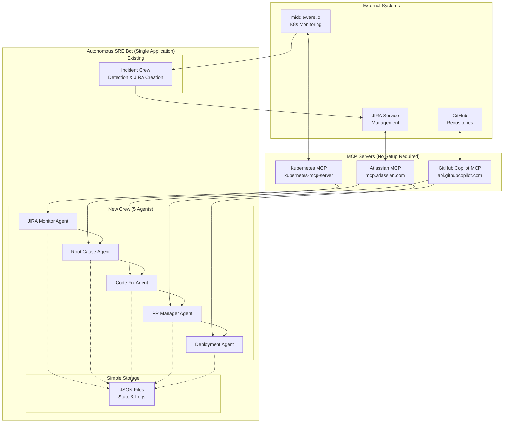
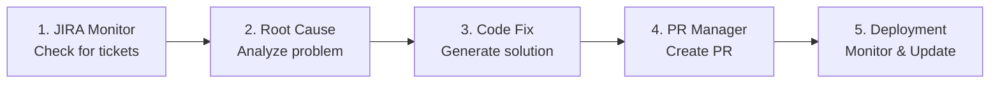
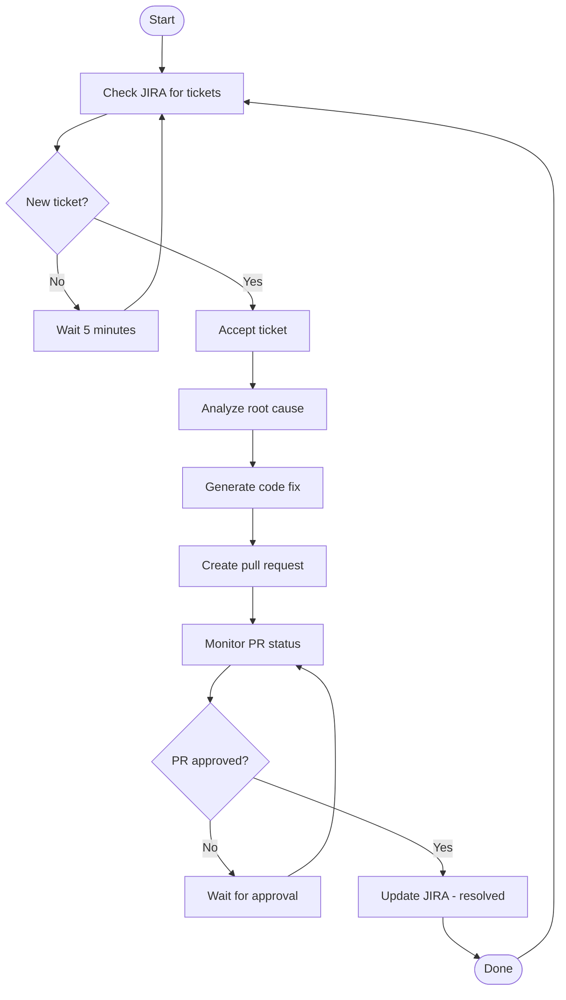
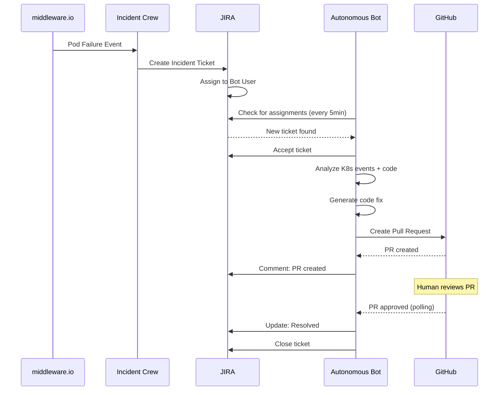

# Simplified Design Document - Autonomous SRE Bot
## College Capstone Project - Code Remediation System

**Document Version:** 1.0  
**Date:** July 22, 2025  
**Project:** Autonomous SRE Bot - College Capstone Project  

---

## 1. System Overview

### 1.1 Architecture Philosophy
This is a simplified autonomous SRE bot built using CrewAI framework for a college capstone project. The system uses MCP servers for external integrations and implements a straightforward workflow to process JIRA assignments and generate code fixes through pull requests. No additional databases or complex infrastructure required.

### 1.2 Simplified Architecture



## 2. Simplified Component Design

### 2.1 MCP Integration (No Complex Setup)

#### 2.1.1 Simple MCP Configuration
```python
# Simple MCP configuration - just add to VS Code mcp.json
{
    "servers": {
        "atlassian": {
            "url": "https://mcp.atlassian.com/v1/sse",
            "type": "http"
        },
        "github": {
            "url": "https://api.githubcopilot.com/mcp/",
            "type": "http"  
        },
        "kubernetes": {
            "command": "npx",
            "args": ["-y", "@kubernetes/mcp-server"],
            "type": "stdio"
        }
    }
}
```

#### 2.1.2 Basic MCP Tools
```python
class SimpleMCPTools:
    """Simple wrapper for MCP tools - no complex infrastructure"""
    
    def __init__(self):
        # These will use the MCP functions available in the environment
        self.atlassian_available = True  # mcp_manoharnv-att functions
        self.github_available = True     # Will be available via GitHub MCP
        self.k8s_available = True        # Will be available via K8s MCP
    
    def get_jira_ticket(self, ticket_id):
        """Simple JIRA ticket retrieval"""
        # Uses existing mcp_manoharnv-att_getJiraIssue
        pass
    
    def create_github_pr(self, repo, title, body, files):
        """Simple GitHub PR creation"""
        # Uses GitHub MCP server functions
        pass
    
    def get_k8s_events(self, namespace, pod_name):
        """Simple Kubernetes events"""
        # Uses K8s MCP server functions
        pass
```

### 2.2 Simple Agent Design

#### 2.2.1 Five Simple Agents


#### 2.2.2 Basic Agent Implementation
```python
from crewai import Agent, Task, Crew
from dataclasses import dataclass
from typing import Dict, Any
import json
import os

@dataclass
class SimpleWorkflowState:
    """Simple state tracking using JSON files"""
    ticket_id: str
    current_step: str
    data: Dict[str, Any]
    
    def save(self):
        """Save state to JSON file"""
        state_file = f"states/{self.ticket_id}.json"
        os.makedirs("states", exist_ok=True)
        with open(state_file, 'w') as f:
            json.dump({
                'ticket_id': self.ticket_id,
                'current_step': self.current_step,
                'data': self.data
            }, f, indent=2)
    
    @classmethod
    def load(cls, ticket_id: str):
        """Load state from JSON file"""
        state_file = f"states/{ticket_id}.json"
        if os.path.exists(state_file):
            with open(state_file, 'r') as f:
                data = json.load(f)
                return cls(**data)
        return None

class SimpleJIRAAgent(Agent):
    """Agent 1: Monitor JIRA for assigned tickets"""
    
    def __init__(self):
        super().__init__(
            role="JIRA Monitor",
            goal="Check for JIRA tickets assigned to autonomous bot",
            backstory="You monitor JIRA for new ticket assignments",
            verbose=True
        )
    
    def check_assignments(self):
        """Check for new JIRA assignments"""
        # Uses mcp_manoharnv-att functions
        # Returns list of new ticket IDs
        pass

class SimpleRCAAgent(Agent):
    """Agent 2: Root Cause Analysis"""
    
    def __init__(self):
        super().__init__(
            role="Root Cause Analyst", 
            goal="Analyze K8s events and correlate with code",
            backstory="You investigate incidents to find root causes",
            verbose=True
        )
    
    def analyze_incident(self, ticket_context):
        """Perform simple root cause analysis"""
        # 1. Get K8s events using K8s MCP
        # 2. Get code from GitHub using GitHub MCP
        # 3. Correlate and generate hypothesis
        pass

class SimpleCodeFixAgent(Agent):
    """Agent 3: Generate Code Fixes"""
    
    def __init__(self):
        super().__init__(
            role="Code Fix Generator",
            goal="Generate code fixes based on root cause",
            backstory="You create code solutions for identified problems", 
            verbose=True
        )
    
    def generate_fix(self, root_cause):
        """Generate simple code fix"""
        # Uses GitHub MCP for code analysis and generation
        pass

class SimplePRAgent(Agent):
    """Agent 4: Pull Request Manager"""
    
    def __init__(self):
        super().__init__(
            role="PR Manager",
            goal="Create and manage pull requests",
            backstory="You handle GitHub pull request operations",
            verbose=True
        )
    
    def create_pr(self, fix_details):
        """Create simple pull request"""
        # Uses GitHub MCP to create PR
        pass

class SimpleDeploymentAgent(Agent):
    """Agent 5: Deployment Monitor"""
    
    def __init__(self):
        super().__init__(
            role="Deployment Monitor", 
            goal="Monitor PR approval and update JIRA",
            backstory="You track deployment status and close tickets",
            verbose=True
        )
    
    def monitor_and_close(self, pr_details):
        """Monitor PR and update JIRA when done"""
        # 1. Check PR status using GitHub MCP
        # 2. Update JIRA using Atlassian MCP
        pass
```

### 2.3 Simple Workflow (No Complex State Management)

#### 2.3.1 Linear Workflow


#### 2.3.2 Simple State Tracking
```python
class SimpleAutonomousCrew:
    """Main crew orchestrator - no complex state management"""
    
    def __init__(self):
        self.jira_agent = SimpleJIRAAgent()
        self.rca_agent = SimpleRCAAgent()
        self.fix_agent = SimpleCodeFixAgent()
        self.pr_agent = SimplePRAgent()
        self.deploy_agent = SimpleDeploymentAgent()
        
    def run_workflow(self):
        """Simple linear workflow execution"""
        while True:
            try:
                # Step 1: Check for new tickets
                new_tickets = self.jira_agent.check_assignments()
                
                for ticket_id in new_tickets:
                    self.process_ticket(ticket_id)
                    
                # Wait before next check
                time.sleep(300)  # 5 minutes
                
            except Exception as e:
                print(f"Error in workflow: {e}")
                time.sleep(60)  # Wait 1 minute before retry
    
    def process_ticket(self, ticket_id: str):
        """Process a single ticket through the pipeline"""
        
        # Save initial state
        state = SimpleWorkflowState(
            ticket_id=ticket_id,
            current_step="started",
            data={}
        )
        state.save()
        
        try:
            # Step 1: Accept ticket and get details
            ticket_details = self.jira_agent.accept_and_parse(ticket_id)
            state.current_step = "accepted"
            state.data["ticket_details"] = ticket_details
            state.save()
            
            # Step 2: Root cause analysis
            root_cause = self.rca_agent.analyze_incident(ticket_details)
            state.current_step = "analyzed" 
            state.data["root_cause"] = root_cause
            state.save()
            
            # Step 3: Generate fix
            code_fix = self.fix_agent.generate_fix(root_cause)
            state.current_step = "fixed"
            state.data["code_fix"] = code_fix
            state.save()
            
            # Step 4: Create PR
            pr_details = self.pr_agent.create_pr(code_fix)
            state.current_step = "pr_created"
            state.data["pr_details"] = pr_details
            state.save()
            
            # Step 5: Monitor and close
            self.deploy_agent.monitor_and_close(pr_details)
            state.current_step = "completed"
            state.save()
            
        except Exception as e:
            state.current_step = "failed"
            state.data["error"] = str(e)
            state.save()
            print(f"Failed to process ticket {ticket_id}: {e}")
```

### 2.4 Simple Integration Flow

#### 2.4.1 Basic End-to-End Workflow


## 3. Simple Data Models

### 3.1 Basic Data Structures (JSON Files)
```python
# Simple data models for college project
from dataclasses import dataclass
from typing import List, Dict, Optional
from datetime import datetime

@dataclass
class TicketInfo:
    """Simple ticket information"""
    ticket_id: str
    title: str
    description: str
    created_at: str
    
@dataclass  
class RootCauseResult:
    """Simple root cause analysis result"""
    hypothesis: str
    confidence: float  # 0.0 to 1.0
    evidence: List[str]
    
@dataclass
class CodeFix:
    """Simple code fix representation"""
    files_to_change: Dict[str, str]  # filename -> new content
    description: str
    test_plan: str

@dataclass
class PRInfo:
    """Simple PR information"""
    pr_number: int
    url: str
    status: str  # 'open', 'approved', 'merged'
```

### 3.2 Simple Configuration
```yaml
# simple_config.yaml - Just basic settings
autonomous_bot:
  polling_interval: 300  # 5 minutes
  max_retries: 3
  
  # Simple file storage
  storage:
    states_dir: "./states"
    logs_dir: "./logs"
    
  # Basic settings
  quality_gates:
    min_confidence: 0.7
    
  # Repository settings  
  repositories:
    default_org: "your-college-org"
    allowed_repos: ["capstone-project"]
```

## 4. Simple Implementation Plan

### 4.1 Development Timeline (College Semester)

#### Phase 1: Setup (Week 1-2)
- Set up MCP servers in VS Code
- Create basic CrewAI agents
- Test MCP function calls
- Basic file-based state storage

#### Phase 2: Core Logic (Week 3-6)  
- Implement JIRA monitoring
- Build root cause analysis logic
- Create code fix generation
- Test with sample incidents

#### Phase 3: Integration (Week 7-10)
- GitHub PR creation and monitoring
- End-to-end workflow testing
- Error handling and logging
- Documentation and demo

#### Phase 4: Demo & Documentation (Week 11-12)
- Prepare capstone presentation
- Create demo scenarios
- Write final report
- Code cleanup and comments

### 4.2 Simple Testing Strategy
```python
# Simple test cases for college project
def test_jira_monitoring():
    """Test basic JIRA ticket detection"""
    pass

def test_root_cause_analysis():
    """Test RCA with sample K8s events"""
    pass
    
def test_code_fix_generation():
    """Test fix generation with simple examples"""
    pass

def test_pr_creation():
    """Test GitHub PR creation"""
    pass

def test_end_to_end():
    """Test complete workflow with mock data"""
    pass
```

### 4.3 Simple Monitoring (Just Logs)
```python
import logging
import json
from datetime import datetime

# Simple logging setup - no complex infrastructure
logging.basicConfig(
    level=logging.INFO,
    format='%(asctime)s - %(levelname)s - %(message)s',
    handlers=[
        logging.FileHandler('logs/autonomous_bot.log'),
        logging.StreamHandler()
    ]
)

def log_workflow_step(ticket_id: str, step: str, data: dict):
    """Simple workflow logging"""
    log_entry = {
        'timestamp': datetime.now().isoformat(),
        'ticket_id': ticket_id,
        'step': step,
        'data': data
    }
    
    # Log to file
    logging.info(f"Workflow step: {json.dumps(log_entry)}")
    
    # Save detailed log
    log_file = f"logs/{ticket_id}_{step}.json"
    with open(log_file, 'w') as f:
        json.dump(log_entry, f, indent=2)
```

## 5. College Project Benefits

### 5.1 Learning Outcomes
- **AI/ML Integration**: Using LLMs for code analysis and generation
- **System Integration**: Working with multiple APIs and systems  
- **Workflow Automation**: Building end-to-end automated processes
- **Software Engineering**: Clean code, testing, documentation

### 5.2 Demo Scenarios
1. **Pod Crash Scenario**: Show bot detecting, analyzing, and fixing a simple pod restart issue
2. **Configuration Error**: Demonstrate fixing a configuration mismatch
3. **Resource Limit Issue**: Show bot adjusting resource limits in YAML files

### 5.3 No Complex Infrastructure Required
✅ **No Database**: Just JSON files for state storage  
✅ **No Message Queues**: Simple polling approach  
✅ **No External Monitoring**: Uses existing middleware.io  
✅ **No ArgoCD Setup**: Just creates PRs, humans deploy  
✅ **No Complex Security**: Uses existing JIRA/GitHub permissions  

This simplified design is perfect for a college capstone project - it demonstrates advanced concepts while remaining implementable within academic constraints!
