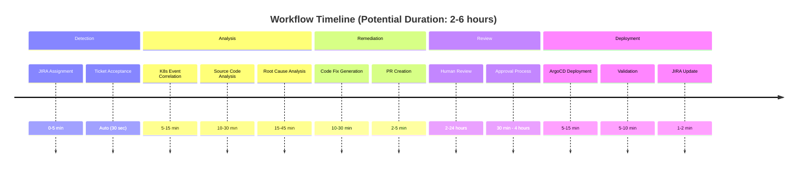
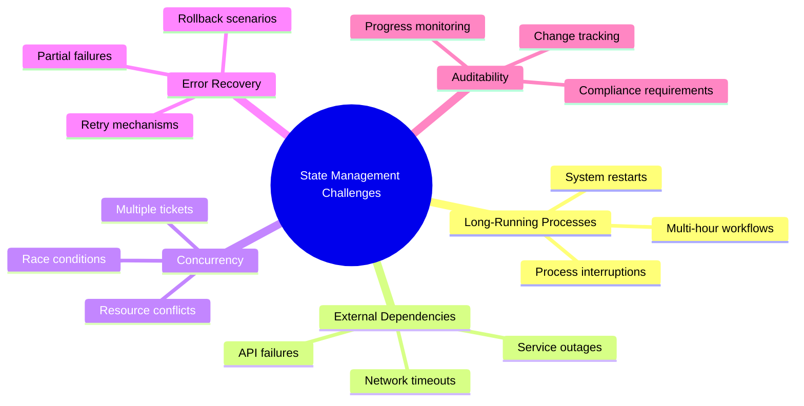
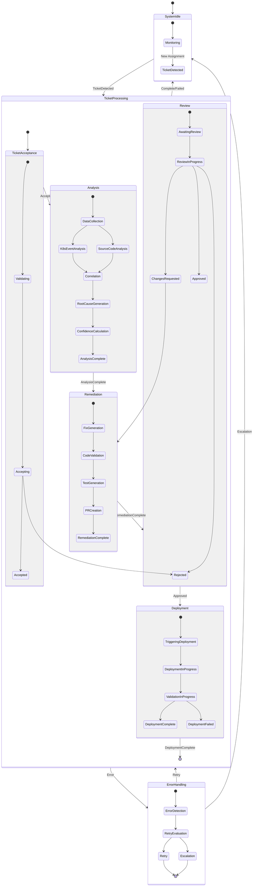
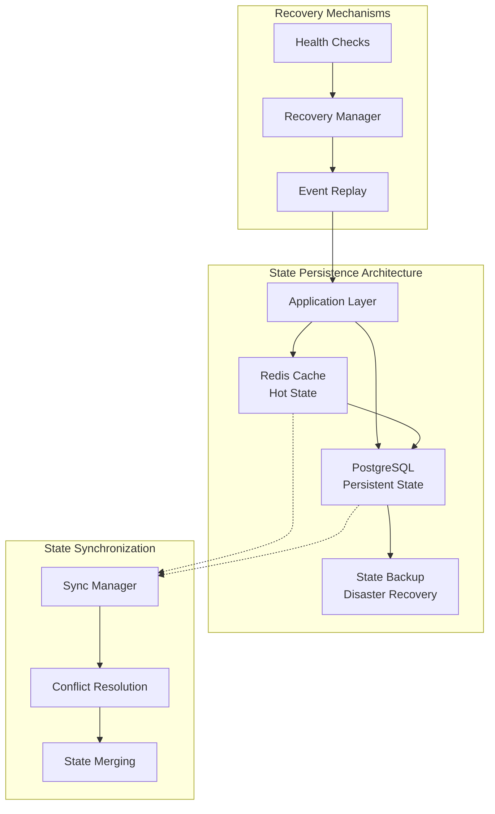
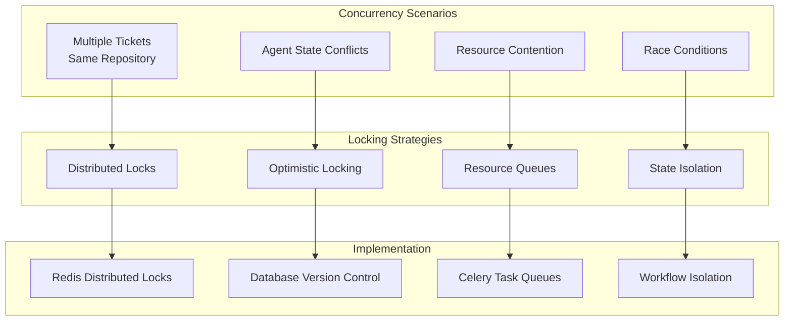

# State Management Deep Dive - Autonomous SRE Bot
## Comprehensive State Management Architecture

**Date:** July 22, 2025  
**Focus:** Detailed explanation of state management patterns and implementation

---

## 1. Why State Management is Critical

### 1.1 Complex Multi-Step Workflow
The autonomous SRE bot manages a complex workflow that spans multiple external systems and can take hours to complete:



### 1.2 Challenges Requiring State Management



## 2. State Machine Architecture

### 2.1 Hierarchical State Design



### 2.2 State Data Structure

```python
from enum import Enum
from dataclasses import dataclass, field
from typing import Dict, Any, Optional, List
from datetime import datetime, timedelta
import uuid
import json

class MainState(str, Enum):
    SYSTEM_IDLE = "system_idle"
    TICKET_PROCESSING = "ticket_processing"
    ERROR_HANDLING = "error_handling"

class TicketProcessingSubState(str, Enum):
    TICKET_ACCEPTANCE = "ticket_acceptance"
    ANALYSIS = "analysis"
    REMEDIATION = "remediation"
    REVIEW = "review"
    DEPLOYMENT = "deployment"

class DetailedState(str, Enum):
    # Ticket Acceptance States
    VALIDATING_TICKET = "validating_ticket"
    ACCEPTING_TICKET = "accepting_ticket"
    TICKET_ACCEPTED = "ticket_accepted"
    TICKET_REJECTED = "ticket_rejected"
    
    # Analysis States
    DATA_COLLECTION = "data_collection"
    K8S_EVENT_ANALYSIS = "k8s_event_analysis"
    SOURCE_CODE_ANALYSIS = "source_code_analysis"
    CORRELATION = "correlation"
    ROOT_CAUSE_GENERATION = "root_cause_generation"
    CONFIDENCE_CALCULATION = "confidence_calculation"
    ANALYSIS_COMPLETE = "analysis_complete"
    
    # Remediation States
    FIX_GENERATION = "fix_generation"
    CODE_VALIDATION = "code_validation"
    TEST_GENERATION = "test_generation"
    PR_CREATION = "pr_creation"
    REMEDIATION_COMPLETE = "remediation_complete"
    
    # Review States
    AWAITING_REVIEW = "awaiting_review"
    REVIEW_IN_PROGRESS = "review_in_progress"
    CHANGES_REQUESTED = "changes_requested"
    APPROVED = "approved"
    REJECTED = "rejected"
    
    # Deployment States
    TRIGGERING_DEPLOYMENT = "triggering_deployment"
    DEPLOYMENT_IN_PROGRESS = "deployment_in_progress"
    VALIDATION_IN_PROGRESS = "validation_in_progress"
    DEPLOYMENT_COMPLETE = "deployment_complete"
    DEPLOYMENT_FAILED = "deployment_failed"

@dataclass
class StateTransition:
    """Represents a state transition with metadata"""
    from_state: str
    to_state: str
    timestamp: datetime
    trigger_event: str
    agent_id: str
    metadata: Dict[str, Any] = field(default_factory=dict)
    
@dataclass
class WorkflowState:
    """Complete state representation for a workflow instance"""
    workflow_id: str
    ticket_id: str
    main_state: MainState
    sub_state: Optional[TicketProcessingSubState]
    detailed_state: Optional[DetailedState]
    context: Dict[str, Any]
    created_at: datetime
    updated_at: datetime
    retry_count: int = 0
    max_retries: int = 3
    timeout_at: Optional[datetime] = None
    escalated: bool = False
    
    def is_expired(self) -> bool:
        """Check if workflow has exceeded timeout"""
        return self.timeout_at and datetime.utcnow() > self.timeout_at
    
    def can_retry(self) -> bool:
        """Check if workflow can be retried"""
        return self.retry_count < self.max_retries and not self.escalated
    
    def to_dict(self) -> Dict[str, Any]:
        """Serialize state for persistence"""
        return {
            "workflow_id": self.workflow_id,
            "ticket_id": self.ticket_id,
            "main_state": self.main_state.value,
            "sub_state": self.sub_state.value if self.sub_state else None,
            "detailed_state": self.detailed_state.value if self.detailed_state else None,
            "context": self.context,
            "created_at": self.created_at.isoformat(),
            "updated_at": self.updated_at.isoformat(),
            "retry_count": self.retry_count,
            "max_retries": self.max_retries,
            "timeout_at": self.timeout_at.isoformat() if self.timeout_at else None,
            "escalated": self.escalated
        }

class WorkflowStateManager:
    """Central state management for workflow instances"""
    
    def __init__(self):
        self.state_store = {}  # In production, this would be Redis/DB
        self.transition_log = []
        self.state_locks = {}  # For concurrency control
        
    def create_workflow_instance(self, ticket_id: str, initial_context: Dict[str, Any]) -> str:
        """Create a new workflow instance"""
        workflow_id = str(uuid.uuid4())
        
        initial_state = WorkflowState(
            workflow_id=workflow_id,
            ticket_id=ticket_id,
            main_state=MainState.SYSTEM_IDLE,
            sub_state=None,
            detailed_state=None,
            context=initial_context,
            created_at=datetime.utcnow(),
            updated_at=datetime.utcnow()
        )
        
        self.state_store[workflow_id] = initial_state
        return workflow_id
    
    def transition_state(self, workflow_id: str, new_main_state: MainState, 
                        new_sub_state: Optional[TicketProcessingSubState] = None,
                        new_detailed_state: Optional[DetailedState] = None,
                        trigger_event: str = "", agent_id: str = "",
                        context_updates: Dict[str, Any] = None) -> bool:
        """Perform state transition with validation"""
        
        with self._get_state_lock(workflow_id):
            current_state = self.state_store.get(workflow_id)
            if not current_state:
                raise ValueError(f"Workflow {workflow_id} not found")
            
            # Validate transition
            if not self._is_valid_transition(current_state, new_main_state, new_sub_state, new_detailed_state):
                raise ValueError(f"Invalid state transition from {current_state.detailed_state} to {new_detailed_state}")
            
            # Log transition
            transition = StateTransition(
                from_state=f"{current_state.main_state}:{current_state.sub_state}:{current_state.detailed_state}",
                to_state=f"{new_main_state}:{new_sub_state}:{new_detailed_state}",
                timestamp=datetime.utcnow(),
                trigger_event=trigger_event,
                agent_id=agent_id,
                metadata=context_updates or {}
            )
            self.transition_log.append(transition)
            
            # Update state
            current_state.main_state = new_main_state
            current_state.sub_state = new_sub_state
            current_state.detailed_state = new_detailed_state
            current_state.updated_at = datetime.utcnow()
            
            # Update context
            if context_updates:
                current_state.context.update(context_updates)
            
            return True
```

## 3. State Persistence and Recovery

### 3.1 Persistence Layer Design



### 3.2 Database Schema for State Persistence

```sql
-- Workflow state persistence schema
CREATE TABLE workflow_states (
    workflow_id UUID PRIMARY KEY,
    ticket_id VARCHAR(100) NOT NULL,
    main_state VARCHAR(50) NOT NULL,
    sub_state VARCHAR(50),
    detailed_state VARCHAR(50),
    context JSONB NOT NULL,
    created_at TIMESTAMP WITH TIME ZONE NOT NULL,
    updated_at TIMESTAMP WITH TIME ZONE NOT NULL,
    retry_count INTEGER DEFAULT 0,
    max_retries INTEGER DEFAULT 3,
    timeout_at TIMESTAMP WITH TIME ZONE,
    escalated BOOLEAN DEFAULT FALSE,
    version INTEGER DEFAULT 1  -- For optimistic locking
);

CREATE TABLE state_transitions (
    id SERIAL PRIMARY KEY,
    workflow_id UUID REFERENCES workflow_states(workflow_id),
    from_state VARCHAR(200),
    to_state VARCHAR(200),
    timestamp TIMESTAMP WITH TIME ZONE NOT NULL,
    trigger_event VARCHAR(100),
    agent_id VARCHAR(100),
    metadata JSONB,
    created_at TIMESTAMP WITH TIME ZONE DEFAULT NOW()
);

CREATE TABLE workflow_checkpoints (
    id SERIAL PRIMARY KEY,
    workflow_id UUID REFERENCES workflow_states(workflow_id),
    checkpoint_name VARCHAR(100) NOT NULL,
    state_snapshot JSONB NOT NULL,
    created_at TIMESTAMP WITH TIME ZONE DEFAULT NOW()
);

-- Indexes for performance
CREATE INDEX idx_workflow_states_ticket_id ON workflow_states(ticket_id);
CREATE INDEX idx_workflow_states_main_state ON workflow_states(main_state);
CREATE INDEX idx_workflow_states_updated_at ON workflow_states(updated_at);
CREATE INDEX idx_state_transitions_workflow_id ON state_transitions(workflow_id);
CREATE INDEX idx_state_transitions_timestamp ON state_transitions(timestamp);
```

## 4. Concurrency and Locking

### 4.1 Concurrency Challenges



## 5. Key State Management Benefits

### 5.1 **Reliability and Fault Tolerance**
- **System Restart Recovery**: Workflows automatically resume after system restarts
- **Partial Failure Handling**: Individual step failures don't lose entire workflow progress
- **Data Consistency**: ACID transactions ensure state consistency across failures

### 5.2 **Observability and Debugging**
- **Complete Audit Trail**: Every state transition is logged with timestamps and context
- **Progress Tracking**: Real-time visibility into workflow progress
- **Error Forensics**: Detailed error context for debugging failed workflows

### 5.3 **Scalability and Performance**
- **Concurrent Processing**: Multiple workflows can run simultaneously without conflicts
- **Resource Management**: Prevents resource contention through locking mechanisms
- **Load Distribution**: Workflows can be distributed across multiple system instances

### 5.4 **Business Continuity**
- **Long-Running Process Support**: Handles workflows that span hours or days
- **Human Interaction Points**: Manages wait states for human approvals
- **SLA Compliance**: Tracks and enforces timeout requirements

## 6. Real-World Examples

### Example 1: System Restart Scenario
```python
# Before restart - workflow in progress
workflow_state = {
    "workflow_id": "uuid-123",
    "ticket_id": "INFRA-456",
    "main_state": "TICKET_PROCESSING",
    "sub_state": "REVIEW", 
    "detailed_state": "AWAITING_REVIEW",
    "context": {
        "pr_number": 789,
        "repository": "company/infrastructure",
        "analysis_results": {...},
        "generated_fix": {...}
    },
    "created_at": "2025-07-22T10:00:00Z",
    "updated_at": "2025-07-22T11:30:00Z"
}

# After restart - automatic recovery
recovery_manager.recover_active_workflows()
# System detects workflow was awaiting review
# Resumes monitoring PR status for approval
```

### Example 2: Concurrent Workflow Handling
```python
# Two tickets affecting same repository
ticket_1 = "INFRA-123"  # Database connection issue
ticket_2 = "INFRA-124"  # Memory leak in same service

# State manager handles concurrency
async with state_manager.acquire_resource_lock("repository", "company/microservice-x"):
    # Only one workflow can modify the repository at a time
    await workflow_1.create_pull_request()

# Second workflow waits for first to complete
# Prevents conflicting changes
```

### Example 3: Error Recovery with Retries
```python
# Transient error during GitHub API call
try:
    pr = await github_tool.create_pull_request(...)
except GitHubAPIError as e:
    error = WorkflowError(
        error_type=ErrorType.TRANSIENT,
        severity=ErrorSeverity.MEDIUM,
        message=str(e),
        workflow_id=workflow_id,
        retry_count=1
    )
    
    # State manager handles retry with exponential backoff
    await state_manager.handle_workflow_error(error)
    # Workflow automatically retries after 2 seconds
```

This state management system is the backbone that enables the autonomous SRE bot to reliably handle complex, long-running workflows while maintaining data consistency, providing observability, and ensuring business continuity even in the face of failures.
